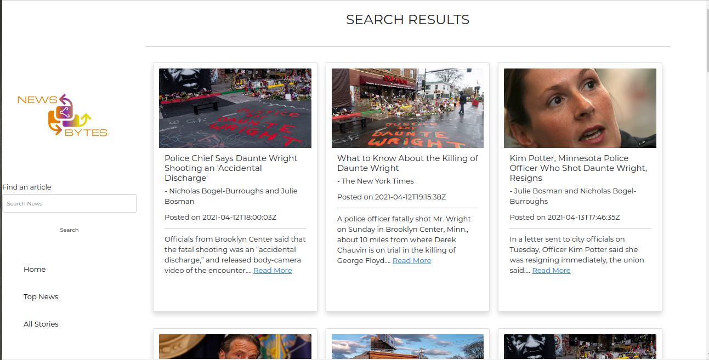

# News Bytes specifications
## Is a Python-flask application consuming the News-Api to display news articles
### It is developed using the following technologies;
* Python 3.6
* Flask
* Html
* Css
* Bootstrap
* Heroku
* Figma prototyping
 
># Homepage

> The News Bytes app homepage has; 
* A sidebar (which is consistent in all the pages) for easy navigation and search of articles alongside viewing top articles and all articles
* News sources alongside specific categories also providing links to the news sources urls and an option to view more artciles on the same category
* A carousel of newspaper images.

# Top Stories

> The top stories page displays all the universal top articles based on popularity

# All Stories

> The all stories page displays all stories universally

# Search Page

> The search input on the sidebar enables for searching for any news article

# 404 Page

> An error 404 page incase of entering a wrong url